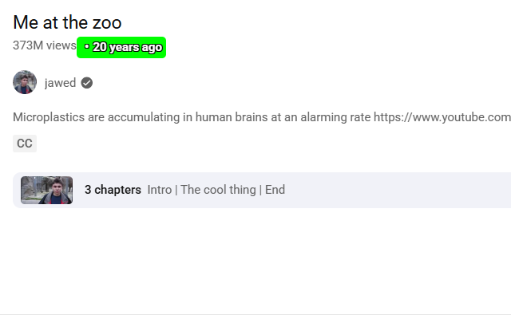
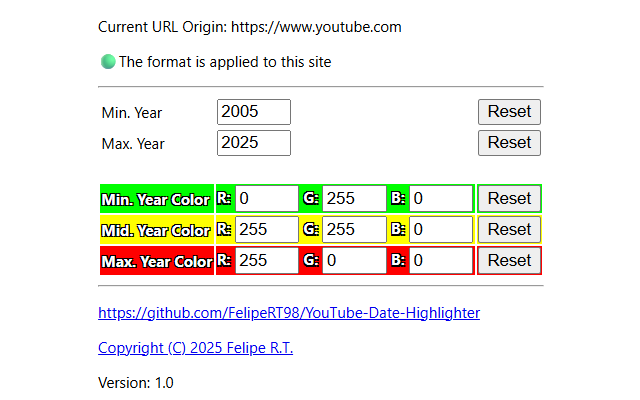

# YouTube Date Highlighter

## What

A browser extension for Chromium-based browsers that highlights YouTube video upload dates.
Each date is color-coded based on the video’s age, making it easier to identify older or newer content.

| Example | Configuration |
|-------------------------------|---------------------------------|
|  |  |

## Characteristics

- **Chromium-based**: Works on Google Chrome, Microsoft Edge, Opera, Brave, and other Chromium-based browsers.
- **English-only**
- **Customizable**: Adjust the colors and year range to fit your preferences.
- **Comments**: The dates of the comments are also highlighted
- **Streams**: The dates of the streams are also highlighted

## Why

> AI miniature

> 3 months ago

> 😞

More and more, YouTube is being flooded with AI content.
I wanted a way to highlight the older videos.

## Usage instructions

Get it from:
https://microsoftedge.microsoft.com/addons/detail/youtube-date-highlighter/apnannejjolknbkjdmchdonohcmddgaa

OR

1. Clone this repository
2. Go to the extension page of your browser
3. Enable Developer mode
4. Click "Load unpacked" and select this repository folder
5. Refresh YouTube (CTRL + SHIFT + R)
